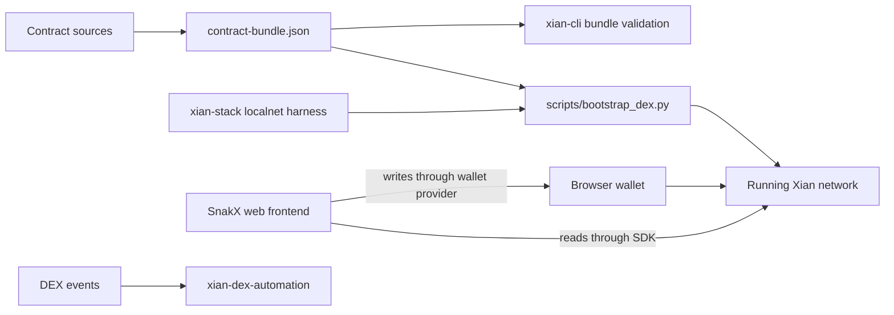

# xian-dex

`xian-dex` owns the Xian DEX product surface: the canonical AMM contracts,
the SnakX web frontend, and the hash-pinned bundle manifest that downstream
consumers (CLI bootstrap flows, localnet harnesses, dapps) deploy and
verify against.

This repo holds *the DEX* — both contracts and frontend — as a single
tightly-coupled system. Operator automation that watches DEX events and
acts on them lives in [`xian-dex-automation`](../xian-dex-automation), not
here.

## Product Shape



## Status

`candidate`. Contracts are usable and covered by package-local tests, but
still deserve deeper hardening before being treated as a polished
production drop-in.

## Quick Start

Contracts and tests:

```bash
uv sync --group dev
uv run python scripts/validate_contracts.py
uv run pytest
```

The Python workspace expects sibling `xian-contracting` and `xian-linter`
checkouts, matching the rest of the Xian repo set.

Frontend:

```bash
cd web
npm install
npm run dev      # local dev server
npm run build    # production build
```

## Deployment and Integration

There are three supported ways to consume the DEX, depending on what you are
building:

| Consumer | Use this | Why |
| --- | --- | --- |
| Localnet / release harness | `scripts/bootstrap_dex.py` delegating to the stack backend | exercises the same local deployment path while keeping the product entrypoint in this repo |
| Operators / app starters | `scripts/bootstrap_dex.py` from this repo | installs the packaged DEX contracts onto a running network without putting product logic in `xian-cli` |
| Dapps / custom tooling | `contract-bundle.json` and the canonical contract names | verifies source hashes and knows deployment order / roles |

Validate the bundle from this repo:

```bash
uv run python scripts/validate_contracts.py
uv run --project ../xian-cli xian contract bundle validate contract-bundle.json
```

Bootstrap DEX contracts into a stack localnet from the product repo:

```bash
cd ../xian-stack
make localnet-init
make localnet-up
cd ../xian-dex
uv run python scripts/bootstrap_dex.py --recipe core
```

For operator automation, validate the repo-owned bundle with `xian-cli` and
run the repo bootstrap script after the node is healthy:

```bash
uv run --project ../xian-cli xian contract bundle validate contract-bundle.json
XIAN_NODE_URL=http://127.0.0.1:26657 \
XIAN_WALLET_PRIVATE_KEY="$XIAN_PRIVATE_KEY" \
  uv run python scripts/bootstrap_dex.py --recipe local-demo
```

Read DEX state from Python:

```python
from xian_py import Xian

with Xian("http://127.0.0.1:26657") as client:
    pair = client.contract("con_pairs").call(
        "pairFor",
        tokenA="currency",
        tokenB="demo_token",
    )
    reserves = client.contract("con_pairs").call("getReserves", pair=pair)
    quote = client.contract("con_dex").call(
        "getAmountsOut",
        amountIn=10,
        src="currency",
        path=[pair],
    )
    print(pair, reserves, quote)
```

Read DEX state from TypeScript:

```ts
import { XianClient } from "@xian-tech/client";

const client = new XianClient({ rpcUrl: "http://127.0.0.1:26657" });
const pair = await client.contract("con_pairs").call("pairFor", {
  tokenA: "currency",
  tokenB: "demo_token",
});
const quote = await client.contract("con_dex").call("getAmountsOut", {
  amountIn: 10,
  src: "currency",
  path: [pair],
});

console.log(pair, quote);
```

The frontend defaults to the public node RPC and lets users change the RPC
from the Settings modal. For local testing, point it at the same local node
used for bootstrap and make sure the browser wallet is connected to that
chain before sending transactions.

## Principles

- **One coupled system.** Contracts and frontend ship together; review and
  validate them as one product.
- **Router-driven liquidity.** Pair balance crediting is router-driven;
  unsolicited token transfers into `con_pairs` are not automatically
  attributed to any pair.
- **Bundle as the canonical interface.** Downstream consumers deploy from
  `contract-bundle.json` (hash-pinned source, contract roles, deployment
  order, default chi budgets), not from raw `src/` files.
- **No off-chain automation here.** Event-driven actions, schedulers, and
  fillers belong in `xian-dex-automation`.
- **Fee-on-transfer support is bounded.** The router handles
  fee-on-transfer ingress and final output, but known fee-on-transfer
  bridge tokens must be flagged with `set_fee_on_transfer_token(...)` and
  are then rejected in supporting multi-hop routes.

## Key Directories

- `src/` — contract sources:
  - `con_pairs.py` — pair factory, reserve bookkeeping, and LP balance
    logic.
  - `con_dex.py` — router-style liquidity and swap entrypoints.
  - `con_dex_helper.py` — convenience helper around the router for
    single-pair buy/sell flows.
  - `con_lp_token.py` — XSC001-compatible LP token template for pairs that
    mint transferable LP tokens.
- `contract-bundle.json` — machine-readable bundle manifest with source
  hashes, contract roles, deployment order, and default chi budgets.
- `tests/` — package-local router and pair integration tests, including
  protocol-fee minting, multi-hop routing, and LP token allowance flows.
- `scripts/` — `bootstrap_dex.py` product-owned installer wrapper and
  `validate_contracts.py` lint, compile, and bundle-hash checker.
- `web/` — SnakX frontend (Vite + React + TypeScript). Talks to the
  canonical contract names (`con_pairs`, `con_dex`, `con_dex_helper`)
  through `@xian-tech/client` for reads and the injected browser wallet
  provider for writes. See [web/README.md](web/README.md) for route-level
  and wallet integration details.

## Contract Behavior Notes

- Router liquidity paths return and enforce actual received amounts, which
  matters for fee-on-transfer tokens.
- Every pair has a bound XSC001 LP token contract. Create pairs with
  `createPair(tokenA, tokenB, lpToken=...)`, or pass `lpToken=...` to
  `addLiquidity` when the router needs to auto-create the pair. The pair
  contract mints/burns that LP token directly; users transfer it with
  `transfer` and approve removals with `approve(amount, to="con_dex")`.
- Fee-on-transfer token flags are router-owner controlled.
- Zero-fee signer accounts can be enabled with
  `set_zero_fee_trader(...)` for market makers or other approved flow.
  Zero-fee routing is signer-based and only applies through the router;
  direct pair swaps remain on the standard 30 bps fee path.
- Plain swap routes reject flagged fee-on-transfer tokens and require the
  supporting-fee router path instead.
- Tokens that expose `get_metadata().precision` route through the DEX with
  precision-aware amount normalization, including integer-precision public
  balances such as `shielded-note-token`.
- `con_dex_helper.py` requires an explicit absolute `deadline` (the older
  relative `deadline_min` pattern was not a real pre-inclusion expiry
  guard, because it was computed from on-chain `now` at execution time).
- Helper quoting is fee-tier aware, so zero-fee market-maker signers do not
  overpay when using the helper path.

## Validation

```bash
uv sync --group dev
uv run python scripts/validate_contracts.py     # lint, compile, bundle hash
uv run pytest                                   # contract tests
( cd web && npm install && npm run build )      # frontend TS build
```

Some optional integration assertions use contracts that live in the sibling
`xian-contracts` checkout. Set `XIAN_CONTRACTS_ROOT` when that checkout is
not at `../xian-contracts/contracts`.

## Related Docs

- [web/README.md](web/README.md) — SnakX frontend routes and wallet integration
- [contract-bundle.json](contract-bundle.json) — canonical hash-pinned bundle for downstream deployers
- [../xian-dex-automation/README.md](../xian-dex-automation/README.md) — deterministic event-driven DEX automation
