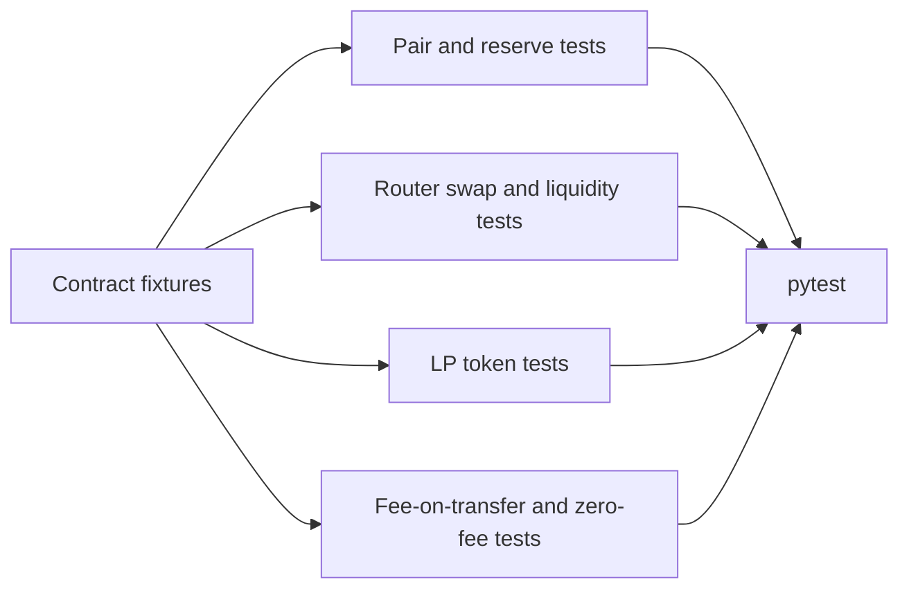

# Tests

This package has package-local integration coverage for the router and pair
contracts.

Current coverage:

- pair creation and reserve setup
- liquidity add/remove against a fee-on-transfer token
- caller-order amount returns
- minimum amount checks on actual received amounts
- single-path fee-on-transfer swap return values
- unsolicited token transfers not being credited to a pair
- router-only pair crediting
- multi-hop routing and invalid-path rejection
- XSC001-compatible LP token minting, transfer, approval, and removal
- protocol fee (`feeTo`) minting on growth
- guarded multi-hop fee-on-transfer routing
- fee-on-transfer token flag permissions and toggling
- zero-fee trader permissions, toggling, and better quote/execution outcomes
- plain-route rejection for flagged fee-on-transfer tokens
- helper absolute-deadline enforcement
- helper quote behavior for zero-fee trader accounts

Still worth adding:

- deeper economic simulations around feeTo and fee-tier configuration
- more scenario coverage around large route sequences and slippage bounds
